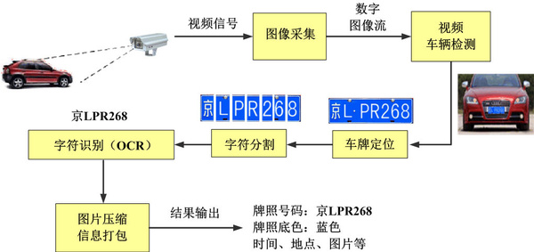
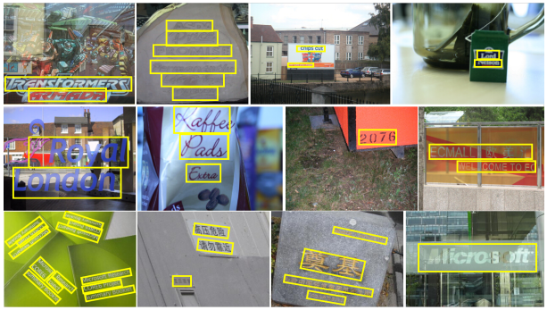

应用综述
=====

.. toctree::
   :maxdepth: 2

.. include:: ../special.rst

一. 基本原理：
++++++++++

::

    光学字符识别（Optical Character Recognition, OCR）是指利用光学字符识别技术,对文本资料的图像文件进行分析识别处理，获取可编辑的文字及版面信息的过程。
    
**车牌识别为例：**

:small:`上图为车牌识别流程示意图`

#. ``预处理`` ：噪声过滤、自动白平衡、自动曝光以及伽马校对、边缘增强、对比度调整等。
#. ``车牌定位`` ：对图像预处理后的灰度图像上进行扫描处理，判定车牌区域。
#. ``字符切开`` ：对图像进行灰度化道闸和二值化等处理，判定位字符区域，然后依据字符尺度特征进行字符切开。
#. ``字符识别`` ：对切开后的字符进行缩放、特征提取，与字符数据库模板中的标准字符表达形式进行匹配区别。

二. 应用场景：
+++++++++++

::

    特定场景识别：专用OCR识别功能，如证件识别、车牌识别、发票识别和银行卡识别。
    通用场景识别：可用于更复杂的自然场景，在移动端也具有更大的应用潜力。

:small:`上图为自然场景中出现的字符识别`

**自然场景识别难点：**

* ``多种语言文本`` ：文字可以有不同的大小、字体、颜色、亮度、对比度等。文本行可能有横向、竖向、弯曲、旋转、扭曲等式样。
* ``文字形态复杂`` ：文字可能出现产生变形(透视、仿射变换)、残缺、模糊等现象。
* ``背景多样`` ：文字可能出现在平面、曲面或折皱面上等
* ``同质干扰`` ：文字附近有复杂的干扰纹理或者非文字区域有近似文字的纹理，比如沙地、草丛、栅栏、砖墙等。

