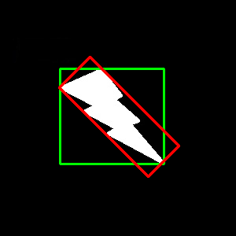

PixelLink 模型分析
=====

.. toctree::
   :maxdepth: 2

::

    首先将相同实例中的正像素通过正链接连在一起，然后来分割出来，最后直接从分割结果中提取文本边界框，不需要外置回归。

.. include:: ../special.rst

一. 基础工作：
++++++++

:small:`上图分别是图像分类、目标定位、语义分割和实力分割的示意图。`

**实例分割** 是检测和分割每个目标实例；**语义分割** 是为每个像素分配一个类标签。

二. 网络结构：
+++++++++

.. image:: ../Image/pl_network.png
:small:`上图是Pixel link 网络结构示意图`

论文中给出了两种网络结构：

* ``PixelLink+VGG16 2s`` ：其融合的特征层包括，{conv2_2, conv3_3, conv4_3, conv5_3, fc_7}，得到的特征图分辨率为原图的 **二分之一**；
* ``PixelLink+VGG16 4s`` ：其融合的特征层包括，{conv3_3,conv4_3, conv5_3, fc_7}，得到的特征图分辨率为原图的 **四分之一**。

整个实现过程包括两部分：先通过深度学习网络预测 **pixel positive** 和 **link positive**，并根据 link positive 连接 pixel positive 得到 **文本实例分割图**，然后从分割图中直接提取文本行的 bbox。具体步骤如下：

#. ``对输入图片进行特征提取`` ：主干网络沿用了 **SSD** 网络结构，以 **VGG16** 作为基础网络，并将 VGG16 的最后两个全连接层改成 **卷积层**；
#. ``提取不同层的特征图`` ：对于 **PixelLink+VGG16 2s** 网络结构：提取了conv2_2, conv3_3, conv4_3, conv5_3, fc_7；
#. ``对提取后的特征层采用自顶向下的方法进行融合`` ：融合操作包括先向 **上采样**，然后再进行 **add操作**；
#. ``获得网络输出进行实例分割`` ：包括 **文本/非文本预测和Link预测**，即为 **pixel positive** 和 **link positive** ，分别对应输出的通道数为 2（1\*2） 和 16（8\*2）。

三. 重点实现：
++++++++++++

:small:`上图是Pixel Link模型结构示意图`

**具体实现步骤如下：**

#. 训练 CNN 模型进行 **文本/非文本预测和链接预测**。
#. 经过阈值处理后，用 **并查集** 方式，将正像素通过正链接连接在一起，实现实例分割。
#. 应用 **MinAreaRect** 直接从分割结果中提取边界框。
#. 后处理通过 **噪声滤波** 筛选需要的文本框

1. 连接像素(Linking Pixels Together)
^^^^^^^^^

.. image:: ../Image/link.png

:small:`上图是 PixelLink 体系结构中链路预测的热力图，代表 8 个方向的链路预测。`

**连接像素的步骤如下：**

#. 设定阈值（大于0.5），得到 pixel positive 集合和 link positive 集合。
#. 根据 link positive 将 pixel positive 进行连接，得到 CCs (conected components) 集合。
#. 根据集合得出分割的实例块，集合中的每个元素代表的就是文本实例。

.. image:: ../Image/link-nu.png
:small:`上图是像素A和B分别在 8 个方向 link 链接的示意图`

**连接规则：**

* 给定两个相邻的 pixel positive，它们之间的 link 预测是由当前 **两个 pixel 共同决定** 的。如上图所示，像素 A 和 B 之间的链接 5 和 4 是由像素 A 和 B **共同决定** 的。
* 两个 pixel 连接 (即两个像素属于同一个文本实例) 的前提条件：**two link 中至少有一个 link positive**。如上图所示，连接像素 A 和 B 的前提是链接 5 和 4 中 **至少有一个为 link positive**。

:maroon:`对于在文本/非文本预测中很难区分的文本，通过链接预测可以区分开。`

2. 提取文本行的 bounding box（Extraction of Bounding Boxes）
^^^^^^^^^^^^^^

**提取文本框步骤：**
基于上述分割的结果，直接通过 opencv 的 MinAreaRext 提取文本的带方向信息的外接矩形框(即带角度信息)。矩形框的格式为((x,y),(w,h),θ)，分别表示 **中心点坐标，当前bbox的宽和高，旋转角度。**

**MinAreaRext方法**

:small:`上图表示的是 MinAreaRect 方法， 从图中可以看出此方法在得到的是图形的最小外接四边形。`

:maroon:`PxielLink 和 SegLink 的区别在于：PixelLink 是直接从分割结果中提取 bbox，而 SegLink 采用的是边框回归。`

3. 实例分割的后处理（Post Filtering after Segmentation）
^^^^^^^^^^^^^^

* 进行后处理的原因是在 **pixel 进行连接的时候会引入噪声**。
* 通过统计训练集中样本的情况，得到 **95% 概率以上的共有特征**，根据此几何特征制定筛选规则。
* 利用筛选规则对已检测到的 bbox 进行判断筛选，最终提高 **文本检测** 的准确率。

四. 训练技巧：
++++++++++++

**总损失函数**

.. math::

    L=\lambda L_{p i x e l}+L_{l i n k}

1. 实例平衡交叉熵损失（Instance-Balanced Cross-Entropy Loss）
^^^^^^^^^^^

平衡 **不同大小的文本检测框** 对损失函数的影响。

.. math::

    w_{i}=\frac{B_{t}}{S_{t}}

.. math::

    B_{i}=\frac{S}{N}, S=\sum_{i}^{N} S_{i}, \forall i \in\{1, \ldots, N\}

公式中 S 代表所有文本框的面积之和, B 表示平均每个文本框的面积。

2. 在线困难样本挖掘 （Online Hard Example Mining）
^^^^^^^^^

平衡 **正负样本数量** 不同对于训练过程中分类效果的影响。

.. math::

    L_{p i x e l}=\frac{1}{(1+r) S} W L_{p i x e l_{-} C E}

.. note:: 
    相关网址：

    #. 文本检测之 PixelLink：https://zhuanlan.zhihu.com/p/38171172
    #. PixelLink 论文地址：https://arxiv.org/pdf/1801.01315.pdf