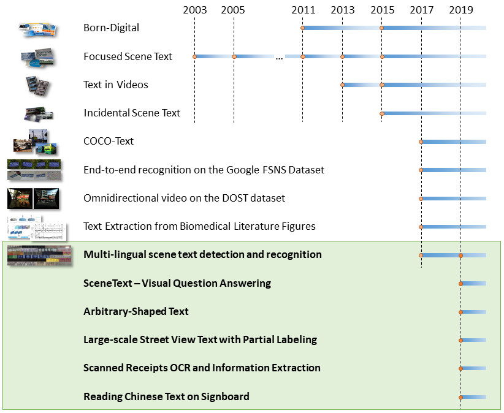
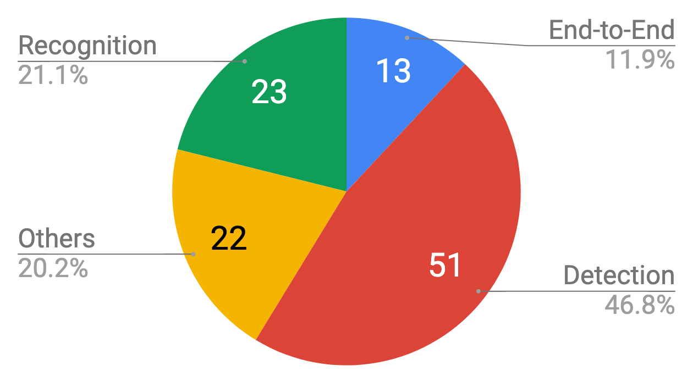
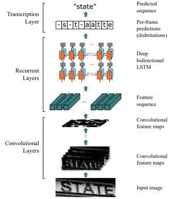
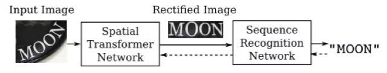
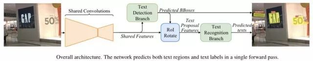
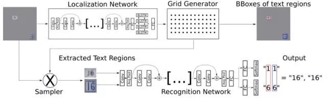

技术基础
=====

.. toctree::
   :maxdepth: 2

.. include:: ../special.rst

一. 数据集：
++++++++++++++

* ``ICDAR2015(IC15)``
IC15 的 Challenge 4 是 **检测任意方向场景文本** 最常用的基准。它由两组组成:训练和测试，分别包含1000和500张图像。
图像是使用 Google Glass 获取的，不需要考虑视点、位置或帧质量。
长度超过3个字符的可读拉丁语文字才会被标注为四边形。

* ``ICDAR2013(IC13)``
IC13 是另一个被广泛使用的场景文本检测基准，包含训练图片229张，测试图片233张。
这个数据集中的 **文本实例大多是水平的，单词被标注为矩形。**

* ``MSRA-TD500(TD500)``
TD500中的文本也是任意方向的，但比IC15中的文本要长得多，因为它们是用 **行注释** 的。
TD500总共包含500张图片，300张用于培训，200张用于测试。中英文都有。

二. 基础网络模块：
+++++++++
* ``特征提取网络`` ：对图像中的文本进行特征提取，可来源于通用场景的图像分类模型。例如，**VGGNet，ResNet、InceptionNet** 等；
* ``特定功能网络`` ：例如，适合提取图像细节特征的 **FCN 全卷积网络**，适合图像校正的 **STN 空间变换网络** 等；
* ``基础检测网络`` ：侧重检测精度的 **Faster-rcnn** 和侧重检测速度的 **SSD** 网络。

三. 基础模型：
+++++++++

1. 文本检测
^^^^^^^^^

1.1 评测方法：
---------

OCR 竞赛 ICDAR 中将文本检测按照 **难度不同分为 Challenge1-4** 。其中 **图片中的文本定位** 分为 Challenge 1、2 和 4，**视频中的图像定位** 为 Challenge 3。主要介绍 Challenge 1、2 和 4 的异同：

* ``Challenges 1`` (Born-Digital)的数据来源于 **电脑制作**；
* ``Challenges 2`` 主要是来源于用户有意识的 **对焦拍摄** 的图像。比如一些翻译的场景，这些场景中文字基本是对焦好的且水平的；
* ``Challenges 4`` 主要来源也是用户拍摄，但是这些照片的拍摄是 **比较随意的场景** 。通常情况下这些图片里的文字角度、清晰度、大小等情况十分复杂。

:maroon:`针对不同的挑战，有不同的评测方法；Challenges 1 和 2 使用的是 DetEva ；Challenges 4 通过 IoU 来判定算法的 recall、precision 的指标。`

DetEval 方法
:::::::::

**recallMat** 和 **precisionMat** 中存储的是每个检测框的召回率和准确率，计算方法为：

.. math::
    \text { recall } M a t_{i, j}=\frac{ \text {area(inter }\left.\left(g t_{i}, \text {det}_{j}\right)\right)}{\text {area}\left(g t_{i}\right)}
.. math::
    \text { precision } M a t_{i, j}=\frac{\text {area}\left(\text {inter}\left(g t_{i}, \text {det}_{j}\right)\right)}{\text {area}\left(\text {det}_{j}\right)}

其中 gt 表示标准框，det 表示检测框。area() 函数表示求矩形的 **面积**，inter()函数表示求两个矩形的 **交集**。

**DetEval 方法考虑到三种情况，分别是图 a、b 和 c 中的三种。** 在考虑三种情况前，先进行以下定义：

#. 定义两个阈值 `r` 和 `p` ，r 表示判断召回率的阈值 0.8，p 表示判断准确率的阈值 0.4。
#. 定义 `RecallValue` 和 `PrecisionValue`，且初始值为 0。
#. 召回率 `Recall` 和 准确率 `Precision` 分别为最终的 RecallValue 除以标准框数量和 PrecisionValue 除以检测框数量。

.. image:: ../Image/deteval.png

* ``one-to-one matches (a)`` ：表示 **一个标准框对应一个检测框**。比较 recallMat 和 precisionMat 与阈值大小。判断是否为 one-to-one 的情况，若满足，就将 RecallValue 和 PrecisionValue 的数值加 **1**。
* ``one-to-many matches (b)`` ：表示 **一个标准框对应多个检测框**。比较 recallMat 和 precisionMat 与阈值大小。判断是否为 one-to-many 的情况，若满足，则对于 RecallValue 值加上 **0.8**，PrecisionValue 值加上 **0.8** \* many（对应检测框的数目）。
* ``many-to-one matches (c)`` ：表示 **多个标准框对应一个检测框**。比较 recallMat 和 precisionMat 与阈值大小。判断是否为 many-to-one 的情况，若满足，则对于 RecallValue 值加上 **0.8** \* many（对应检测框的数目），PrecisionValue 值加上 **0.8**。

最终评价指标：F1-Score，为 Recall 和 Precision 的 **调和平均数**。公式如下：

.. math::
    \mathrm{F} 1=\frac{2 * P * R}{P+R}

IOU 方法
:::::::::

在 **iouMat** 中，统计大于 0.5 的个数，然后除以标准框的个数得到 Recall，除以检测框的个数得到 Precision。然后通过 **F1-Score** 方法得到最终评价指标 F1。

.. math::
    i o u M a t_{i, j}=\frac{ \text {area(inter }\left.\left(g t_{i}, \text {det}_{j}\right)\right)}{\text {area}\left(\text {union}\left(g t_{i}, d e t_{j}\right)\right)}

1.2 常用模型：
---------

近年来出现了各种基于深度学习的技术解决方案。它们从 **特征提取、区域建议网络(RPN)、多目标协同训练、Loss改进、非极大值抑制（NMS）、半监督学习** 等角度对常规物体检测方法进行改造，
极大提升了自然场景图像中文本检测的准确率。例如：
    
    a. ``CTPN`` ：用 **BLSTM** 模块提取字符所在图像 **上下文特征** ，以提高文本块识别精度。
    
    b. ``RRPN`` ：文本框标注采用 **BBOX +方向角度值** 的形式，模型中产生出可旋转的文字区域候选框，并在 **边框回归计算** 过程中找到待测文本行的倾斜角度。
    
    c. ``DMPNet`` ：使用 **四边形（非矩形）标注文本框**，来更紧凑的包围文本区域。
    
    d. ``SegLink`` ：将单词 **切割为更易检测的小文字块** ，再 **预测邻近连接** 将小文字块连成词。
    
    e. ``PixelLink`` ：通过 **实例分割检测文本** ，预测的 **正像素** 通过预测的 **正链接** 加入到文本实例中，然后直接从分割结果中提取边界框。
    
    f. ``EAST`` : 使用具有 **位置意识的NMS（非最大值抑制）** 进行非常密集的预测。
    
    g. ``TextBoxes`` ：调整了文字区域参考框的 **长宽比例**，并将特征层 **卷积核调整为长方形**，从而更适合检测出细长型的文本行。
    
    h. ``FTSN`` ：使用 **Mask-NMS** 代替传统 BBOX 的 NMS 算法来过滤候选框。
    
    i. ``WordSup`` ：采用 **半监督学习策略**，用单词级标注数据来训练字符级文本检测模型。

2. 文本识别
^^^^^^^^^^

* ``CRNN`` 是目前较为流行的图文识别模型，可识别较长的文本序列。利用 **BLSTM** 将特征向量进行融合来 **提取字符序列的上下文特征**，然后得到每列特征的概率分布，最后通过 **转录层(CTC rule)** 进行预测得到文本序列。

* ``RARE`` 模型在识别变形的图像文本时效果很好。模型预测过程中，输入图像首先要被送到一个 **空间变换网络** 中做处理，矫正过的图像然后被送入 **序列识别网络** 中得到文本预测结果。

3. 端到端模型
^^^^^^^^^^^^^^

* ``FOTS`` 是图像文本检测与识别同步训练、端到端可学习的网络模型。引入了 **旋转感兴趣区域（RoIRotate）**, 可以从卷积特征图中产生出定向的文本区域，从而 **支持倾斜文本** 的识别。

* ``STN-OCR`` 是集成了 **图文检测和识别** 功能的端到端可学习模型。在它的检测部分嵌入了一个 **空间变换网络（STN）** 来对原始输入图像进行仿射变换。利用这个空间变换网络，可以对检测到的多个文本块分别执行 **旋转、缩放和倾斜** 等图形矫正动作，从而在后续文本识别阶段得到更好的识别精度。

.. note:: 
    相关网址：

    #. OCR 竞赛 ICDAR 网址：https://rrc.cvc.uab.es
    #. 评测指标官方网址：https://rrc.cvc.uab.es/?com=faq
    #. DetEval方法：https://perso.liris.cnrs.fr/christian.wolf/software/deteval/inde 
    #. OCR技术简介: https://zhuanlan.zhihu.com/p/45376274