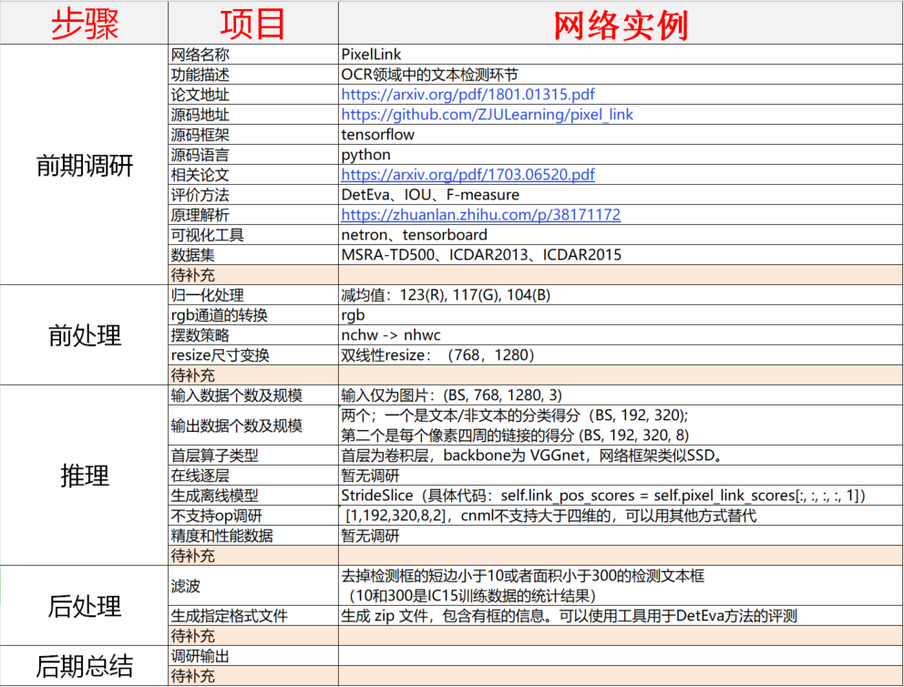
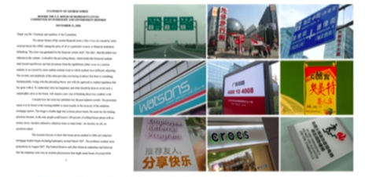
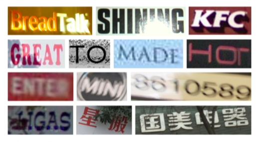
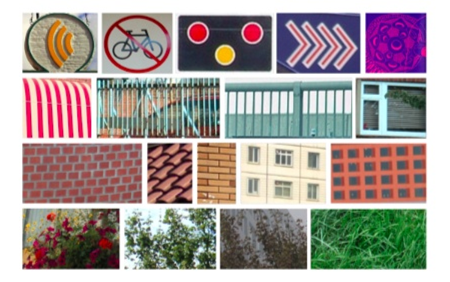
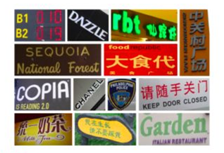

总结
=====

.. toctree::
   :maxdepth: 2

.. include:: ../special.rst

一. PixelLink 网络调研：
++++++++++

:small:`上图是PixelLink网络调研表格输出，对应的网址请看页尾的注释。`

1. 移植细节：
^^^^^^^^^^

* 网络的源码是从论文提供的官方 github 中获取，同时可移植性测试是在 **MLU100，V8.2.1** 软件栈中进行。
* 目前不支持算子为 **StrideSlice** 。主要在网络的最后一层，其作用是对 **五维 tensor 进行切分** ，得到所需要的四维 tensor。根据源码分析，可通过 **修改算子实现** 解决此问题。
* 目前没有确切的网络移植需求以及客户的具体网络实现，因此还 **未进行精度和性能的评测** 。

2. 移植分析：
^^^^^^^^^^

* ``文字检测`` ：PixelLink 是文字检测领域中比较常用的一个网络框架。其中 backbone 为 **SSD 网络** ，而 MLU 对 SSD 已有适配，因此 PixelLink 对 MLU 来说 **可移植性强** 。
* ``文字识别`` ：当前通用的文字时别算法采用了 **RNN 回归网络** ，而 MLU 之前也有成功的 RNN 网络的落地（百度语音项目）。

:maroon:`综上所述，MLU产品适合进入OCR领域，进行相关网络的适配工作。同时根据已有的经验和调研分析，可以提高适配后网络的性能同时保证精度。`

二. 当前挑战：
++++++++++

首先，它与传统 OCR（光学字符识别） 有所区别，因自然场景之中文字变化非常之多，如下图所示：左边是一张典型的 **扫描文档图像**，右边则是 **自然场景** 中采集的多张图像。

**通过对比可以发现:**

* 左图的背景非常 **干净**，右图的背景非常 **杂乱**；
* 左边字体非常 **规整**，右边则 **千变万化**；
* 左边布局较为 **平整统一**，右边则 **多元复杂，缺乏规范**；
* 左边 **颜色单调**，右边 **颜色种类繁多**。

目前来看，深度学习时代之下的场景文字检测与识别技术依然存在巨大挑战，其主要体现在以下 **3 个方面**：

``文字的差异性`` ：存在着语言、字体、方向、排列等各种各样的形态；
    

``背景的复杂性`` ：比如几乎无法区分的元素（标志、篱笆、墙砖、草地等）；

``干扰的多样性`` ：诸如噪声、模糊、失真、低分辨率、光照不均匀、部分遮挡等情况。

二. 未来机遇：
++++++++++

相应而言，针对上述挑战，文字检测与识别具体研究有着以下 **4 个技术趋势** ：

1. 设计更强大的模型；
#. 识别多方向、弯曲文字；
#. 识别多语言文字；
#. 合成更丰富逼真的数据集。

.. note:: 
    PixelLink 网络调研相关：

    #. 论文地址：https://arxiv.org/pdf/1801.01315.pdf
    #. 源码地址：https://github.com/ZJULearning/pixel_link
    #. 相关论文：https://arxiv.org/pdf/1703.06520.pdf
    #. 原理解析：https://zhuanlan.zhihu.com/p/38171172

    相关网址：
    
    #. 深度学习时代的文字检测与识别技术： https://zhuanlan.zhihu.com/p/51725259
